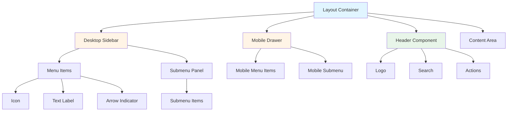
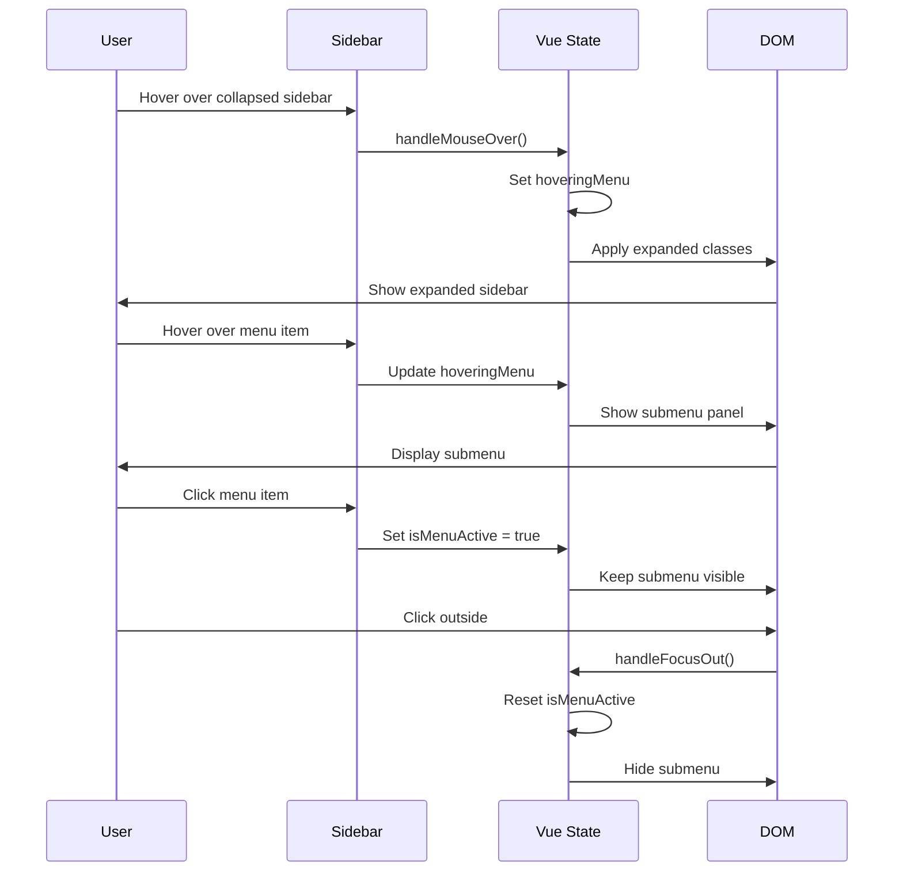

# Design Document: Admin UI Redesign

## Overview

### Purpose

This design document outlines the technical architecture and implementation strategy for redesigning the MedSDN Admin Panel user interface. The redesign focuses on modernizing the sidebar navigation system, improving user experience through enhanced hover interactions, implementing a responsive mobile drawer, and establishing a cohesive design system using Tailwind CSS and Vue.js.

### Scope

The redesign encompasses:
- Complete sidebar navigation system (desktop and mobile)
- Header component updates
- Color system implementation with brand colors
- Hover-based submenu system
- Responsive design across all breakpoints
- Vue.js component architecture for interactive behaviors
- Tailwind CSS configuration and utilities
- Animation and transition system
- Accessibility improvements

### Goals

1. **Enhanced User Experience**: Provide intuitive navigation with smooth transitions and hover interactions
2. **Responsive Design**: Ensure optimal experience across desktop, tablet, and mobile devices
3. **Maintainability**: Create modular, well-structured components that are easy to maintain and extend
4. **Performance**: Maintain fast rendering and smooth animations (60fps)
5. **Accessibility**: Ensure WCAG AA compliance for inclusive access
6. **Brand Consistency**: Implement cohesive design system with customizable brand colors

### Constraints

- Must maintain backward compatibility with existing ACL system
- Must preserve all existing functionality while updating UI
- Must work within Laravel 11 + Vue.js 3 + Vite + Tailwind CSS stack
- Must support RTL (Right-to-Left) layouts for Arabic language
- Must support dark mode
- Cannot break existing package-based architecture
- Must maintain performance standards (Core Web Vitals)

## Architecture

### High-Level Architecture

The admin UI follows a layered architecture pattern:

```
┌─────────────────────────────────────────────────────────────┐
│                     Presentation Layer                       │
│  ┌──────────────┐  ┌──────────────┐  ┌──────────────┐      │
│  │ Blade Views  │  │ Vue Components│  │  Tailwind CSS│      │
│  └──────────────┘  └──────────────┘  └──────────────┘      │
└─────────────────────────────────────────────────────────────┘
                            │
┌─────────────────────────────────────────────────────────────┐
│                    Component Layer                           │
│  ┌──────────────┐  ┌──────────────┐  ┌──────────────┐      │
│  │   Sidebar    │  │    Header    │  │ Mobile Drawer│      │
│  │  Component   │  │  Component   │  │  Component   │      │
│  └──────────────┘  └──────────────┘  └──────────────┘      │
└─────────────────────────────────────────────────────────────┘
                            │
┌─────────────────────────────────────────────────────────────┐
│                     State Management                         │
│  ┌──────────────┐  ┌──────────────┐  ┌──────────────┐      │
│  │ isMenuActive │  │ hoveringMenu │  │  activeMenu  │      │
│  └──────────────┘  └──────────────┘  └──────────────┘      │
└─────────────────────────────────────────────────────────────┘
                            │
┌─────────────────────────────────────────────────────────────┐
│                      Data Layer                              │
│  ┌──────────────┐  ┌──────────────┐  ┌──────────────┐      │
│  │  Menu Config │  │  ACL System  │  │  User Prefs  │      │
│  └──────────────┘  └──────────────┘  └──────────────┘      │
└─────────────────────────────────────────────────────────────┘
```

### Component Architecture



### State Management Architecture

The application uses Vue.js reactive state management:

```javascript
// Root App State
{
  isMenuActive: false,        // Tracks if menu is actively clicked
  hoveringMenu: null,         // Tracks which menu is being hovered
  activeMenu: null,           // Tracks expanded menu in mobile
  sidebarCollapsed: false     // Tracks sidebar collapse state
}
```

### Interaction Flow



## Components and Interfaces

### 1. Desktop Sidebar Component

**Location**: `packages/Webkul/Admin/src/Resources/views/components/layouts/sidebar/desktop/index.blade.php`

**Responsibilities**:
- Render navigation menu items
- Handle expand/collapse states
- Manage hover interactions
- Display submenu panels
- Apply active states

**Props/Data**:
```php
// Blade Template Data
$menu = menu()->getItems('admin');  // Menu items from ACL system
```

**Vue.js State**:
```javascript
{
  isMenuActive: Boolean,
  hoveringMenu: String|null
}
```

**Methods**:
```javascript
handleMouseOver(menuKey: string): void
handleMouseLeave(): void
handleFocusOut(event: Event): void
```

**CSS Classes**:
- Base: `fixed top-[60px] h-[calc(100vh-60px)] w-[200px]`
- Collapsed: `group-[.sidebar-collapsed]/container:w-[70px]`
- Transitions: `transition-all duration-300`
- Z-index: `z-[10002]`

### 2. Submenu Panel Component

**Responsibilities**:
- Display child menu items
- Position relative to parent menu
- Handle hover states
- Support RTL layouts

**Structure**:
```html
<div class="absolute ltr:left-[200px] rtl:right-[199px] 
            min-w-[140px] max-w-max
            bg-white dark:bg-gray-900
            shadow-lg rounded-lg">
  <!-- Submenu items -->
</div>
```

**Positioning Logic**:
- LTR: Position to the right of sidebar (left: 200px)
- RTL: Position to the left of sidebar (right: 199px)
- Vertical: Align with parent menu item

### 3. Mobile Drawer Component

**Location**: `packages/Webkul/Admin/src/Resources/views/components/layouts/sidebar/mobile/index.blade.php`

**Responsibilities**:
- Render mobile navigation drawer
- Handle accordion-style submenus
- Manage expanded/collapsed states
- Auto-expand active menu on load

**Vue.js State**:
```javascript
{
  activeMenu: String|null  // Currently expanded menu key
}
```

**Methods**:
```javascript
toggleMenu(menuKey: string): void {
  this.activeMenu = this.activeMenu === menuKey ? null : menuKey;
}

mounted() {
  // Auto-expand menu containing active page
  const activeMenuItem = findActiveMenuItem(this.menu);
  if (activeMenuItem) {
    this.activeMenu = activeMenuItem.parentKey;
  }
}
```

**CSS Classes**:
- Width: `w-[280px]` (80% on small screens)
- Submenu expanded: `max-h-[500px]`
- Submenu collapsed: `max-h-0 overflow-hidden`
- Transitions: `transition-all duration-300`

### 4. Header Component

**Location**: `packages/Webkul/Admin/src/Resources/views/components/layouts/header/index.blade.php`

**Responsibilities**:
- Display logo and branding
- Render hamburger menu for mobile
- Integrate mega search
- Show user actions (dark mode, notifications, profile)

**Structure**:
```html
<header class="sticky top-0 z-[10001] 
               flex items-center justify-between
               px-2 py-2 sm:px-4 sm:py-2.5
               bg-white dark:bg-gray-900">
  <div class="flex items-center gap-2">
    <!-- Logo -->
    <!-- Hamburger (mobile) -->
  </div>
  
  <div class="flex items-center gap-1 sm:gap-2.5">
    <!-- Mega Search -->
    <!-- Dark Mode Toggle -->
    <!-- Shop Link -->
    <!-- Notifications -->
    <!-- User Profile -->
  </div>
</header>
```

### 5. Layout Container Component

**Location**: `packages/Webkul/Admin/src/Resources/views/components/layouts/index.blade.php`

**Responsibilities**:
- Orchestrate layout structure
- Manage sidebar collapse state
- Apply responsive padding to content area
- Coordinate between header, sidebar, and content

**Structure**:
```html
<div class="group/container" :class="{'sidebar-collapsed': sidebarCollapsed}">
  <x-admin::layouts.header />
  
  <x-admin::layouts.sidebar.desktop />
  
  <x-admin::layouts.sidebar.mobile />
  
  <div class="pt-[60px] 
              lg:ltr:pl-[286px] lg:rtl:pr-[286px]
              lg:group-[.sidebar-collapsed]/container:ltr:pl-[85px]
              lg:group-[.sidebar-collapsed]/container:rtl:pr-[85px]
              transition-all duration-300">
    {{ $slot }}
  </div>
</div>
```

### 6. Menu Item Component (Conceptual)

**Responsibilities**:
- Render individual menu item
- Display icon, text, and arrow indicator
- Handle active states
- Support custom menu names

**Interface**:
```typescript
interface MenuItem {
  key: string;
  name: string;
  url: string;
  icon: string;
  children?: MenuItem[];
  isActive: boolean;
}
```

**Rendering Logic**:
```php
// Get custom name or default
$menuName = core()->getConfigData('general.settings.menu.' . $menuItem->getKey()) 
            ?? $menuItem->getName();

// Check if active
$isActive = request()->is($menuItem->getUrl());

// Render with appropriate classes
```

## Data Models

### Menu Configuration Model

```typescript
interface MenuConfig {
  items: MenuItem[];
  acl: ACLConfig;
  customNames: Record<string, string>;
}

interface MenuItem {
  key: string;              // Unique identifier (e.g., 'dashboard', 'catalog')
  name: string;             // Default display name
  url: string;              // Route URL
  icon: string;             // Icon class (e.g., 'icon-dashboard')
  sort: number;             // Display order
  children?: MenuItem[];    // Nested menu items
  permission?: string;      // ACL permission key
}

interface ACLConfig {
  permissions: Record<string, boolean>;
  roles: string[];
}
```

### UI State Model

```typescript
interface SidebarState {
  isCollapsed: boolean;
  isMenuActive: boolean;
  hoveringMenu: string | null;
  activeMenu: string | null;  // For mobile
}

interface ThemeState {
  darkMode: boolean;
  direction: 'ltr' | 'rtl';
  brandColor: string;
}

interface ResponsiveState {
  isMobile: boolean;
  isTablet: boolean;
  isDesktop: boolean;
  breakpoint: 'sm' | 'md' | 'lg' | 'xl';
}
```

### Configuration Storage

**Tailwind Config** (`packages/Webkul/Admin/tailwind.config.js`):
```javascript
module.exports = {
  darkMode: 'class',
  theme: {
    extend: {
      colors: {
        brandColor: '#your-brand-color',
        darkGreen: '#060C07',
        darkBlue: '#04060C',
        darkPink: '#0C0609'
      },
      fontFamily: {
        icon: ['icomoon']
      },
      screens: {
        sm: '525px',
        md: '768px',
        lg: '1024px',
        xl: '1240px'
      }
    }
  },
  safelist: [
    { pattern: /icon-/ }
  ]
}
```

**Menu Custom Names** (stored in database via config system):
```php
// Storage format
'general.settings.menu.{menuKey}' => 'Custom Name'

// Example
'general.settings.menu.dashboard' => 'لوحة التحكم'
'general.settings.menu.catalog' => 'الكتالوج'
```

### Icon System Model

```typescript
interface IconConfig {
  fontFamily: 'icomoon';
  prefix: 'icon-';
  icons: {
    // Navigation
    'icon-dashboard': string;
    'icon-catalog': string;
    'icon-customers': string;
    'icon-sales': string;
    'icon-marketing': string;
    'icon-settings': string;
    
    // Arrows
    'icon-right-arrow': string;
    'icon-left-arrow': string;
    'icon-arrow-up': string;
    'icon-arrow-down': string;
    
    // Actions
    'icon-menu': string;
    'icon-close': string;
    'icon-search': string;
    'icon-notification': string;
    'icon-user': string;
  };
  sizes: {
    sm: 'text-base',
    md: 'text-xl',
    lg: 'text-2xl'
  };
}
```

### Animation Configuration Model

```typescript
interface AnimationConfig {
  transitions: {
    sidebar: {
      duration: '300ms',
      easing: 'ease-in-out',
      property: 'width'
    },
    submenu: {
      duration: '300ms',
      easing: 'ease-in-out',
      property: 'opacity, transform'
    },
    colors: {
      duration: '200ms',
      easing: 'ease-in-out',
      property: 'background-color, color'
    },
    arrow: {
      duration: '300ms',
      easing: 'ease-in-out',
      property: 'transform'
    }
  },
  performance: {
    targetFPS: 60,
    useGPUAcceleration: true,
    willChange: ['width', 'transform', 'opacity']
  }
}
```


## Correctness Properties

*A property is a characteristic or behavior that should hold true across all valid executions of a system—essentially, a formal statement about what the system should do. Properties serve as the bridge between human-readable specifications and machine-verifiable correctness guarantees.*

### Property Reflection Analysis

After analyzing all acceptance criteria, I identified the following redundancies and consolidations:

**Redundancy Group 1: Sidebar State Management**
- Properties 2.1 (hover expands) and 2.2 (mouse leave collapses) can be combined into a single round-trip property
- Property 17.12 (toggle twice returns to original) is a general round-trip property that subsumes specific toggle behaviors

**Redundancy Group 2: Color Application**
- Properties 4.3 (active menu colors) and 4.4 (inactive menu colors) are complementary and should remain separate
- Property 1.4 (dark mode styling) is a general property that applies to all components

**Redundancy Group 3: Menu Item Display**
- Properties 12.2 and 12.3 (custom vs default names) can be combined into a single property about name resolution
- Property 12.4 is redundant as it just extends the scope of 12.2/12.3

**Redundancy Group 4: ACL Integration**
- Properties 14.2 and 14.3 are identical and should be merged

**Redundancy Group 5: Responsive Behavior**
- Properties 8.1 and 8.2 (hide desktop/show mobile) are complementary aspects of the same responsive behavior

After reflection, the following properties provide unique validation value:


### Property 1: Sidebar Collapse State Round-Trip

*For any* sidebar state (expanded or collapsed), toggling the collapse state twice should return the sidebar to its original state with the same width, visibility of text labels, and icon display.

**Validates: Requirements 1.2, 1.3, 17.12**

### Property 2: Hover Expansion with Active State Override

*For any* collapsed sidebar, hovering should expand it to full width, and moving the mouse away should collapse it back, UNLESS the menu is actively clicked (isMenuActive = true), in which case it should remain expanded regardless of hover state.

**Validates: Requirements 2.1, 2.2, 2.3**

### Property 3: Menu Items with Children Display Arrow Indicator

*For any* menu item that has child items, the system should display a right arrow icon (icon-right-arrow in LTR, icon-left-arrow in RTL) to indicate expandability.

**Validates: Requirements 3.1**

### Property 4: Parent Menu Hover Shows Submenu Panel

*For any* parent menu item with children, hovering over it should display the submenu in a separate panel positioned to the right (LTR) or left (RTL) of the sidebar.

**Validates: Requirements 3.2**


### Property 5: Submenu Styling Consistency

*For any* submenu panel, it should use the same styling as the main sidebar including white background in light mode, dark background in dark mode, and consistent border/shadow styling.

**Validates: Requirements 3.5**

### Property 6: Menu Click Toggles Active State

*For any* menu item, clicking on it should toggle the isMenuActive state, and when both isMenuActive is true AND hoveringMenu matches the menu key, the submenu should remain visible.

**Validates: Requirements 3.6, 3.7**

### Property 7: Submenu Hides on Mouse Leave

*For any* visible submenu, when the user moves the mouse away from both the parent menu item and the submenu area, the submenu should hide.

**Validates: Requirements 3.8**

### Property 8: Active Menu Item Color Application

*For any* menu item that is active (matches current route), the system should apply white text color with bg-brandColor background, while inactive items should use gray-600 text (dark:gray-300 in dark mode).

**Validates: Requirements 4.3, 4.4**


### Property 9: Mobile Drawer Submenu Toggle

*For any* menu item with children in the mobile drawer, clicking on it should toggle the submenu visibility, expanding it if collapsed or collapsing it if expanded.

**Validates: Requirements 5.3**

### Property 10: Mobile Drawer Arrow Icon Rotation

*For any* menu item with children in the mobile drawer, the arrow icon should rotate based on the menu state—pointing down when collapsed and pointing up when expanded.

**Validates: Requirements 5.5**

### Property 11: Mobile Drawer Active Submenu Border

*For any* active/expanded submenu in the mobile drawer, it should display a left border with border-l-brandColor to indicate its active state.

**Validates: Requirements 5.8**

### Property 12: Mobile Drawer Auto-Expands Active Menu

*For any* page load where a menu item is active (matches current route), the mobile drawer should automatically expand the parent menu containing that active item.

**Validates: Requirements 5.10, 9.9**


### Property 13: Hamburger Menu Visibility on Mobile

*For any* viewport width smaller than the lg breakpoint (1024px), the header should display a hamburger menu icon, and the desktop sidebar should be hidden while the mobile drawer becomes available.

**Validates: Requirements 6.4, 8.1, 8.2**

### Property 14: Icon System Font Family Consistency

*For all* icon elements in the admin panel, they should use the icomoon font family and have class names with the `icon-` prefix.

**Validates: Requirements 7.1, 7.2**

### Property 15: Icon System Dark Mode Support

*For any* icon element, when dark mode is enabled, the icon color should automatically adjust from gray-500 (light mode) to gray-300 (dark mode) unless explicitly overridden.

**Validates: Requirements 7.4, 7.7**

### Property 16: Icon System Backward Compatibility

*For all* existing icon classes used in the current system, they should continue to work after the redesign without requiring code changes.

**Validates: Requirements 7.6**


### Property 17: Content Padding Adjusts with Sidebar State

*For any* sidebar state (expanded or collapsed), the main content area padding should adjust accordingly—using `lg:ltr:pl-[286px]` when expanded and `lg:group-[.sidebar-collapsed]/container:ltr:pl-[85px]` when collapsed (with RTL equivalents).

**Validates: Requirements 8.3**

### Property 18: Responsive Layout Integrity

*For any* screen size within the supported breakpoints (sm: 525px, md: 768px, lg: 1024px, xl: 1240px), the layout should maintain proper structure without overlapping elements or broken layouts.

**Validates: Requirements 8.7**

### Property 19: Click Outside Closes Menu

*For any* open menu with visible submenu, clicking anywhere outside the menu and submenu area should close the menu and reset the isMenuActive state.

**Validates: Requirements 9.5**

### Property 20: Custom Menu Name Resolution

*For any* menu item, the system should first check for a custom menu name in the configuration (`general.settings.menu.{menuKey}`), and if found, display the custom name; otherwise, display the default name from the menu item definition. This applies to both parent menus and submenus.

**Validates: Requirements 12.1, 12.2, 12.3, 12.4**


### Property 21: Multi-Language Custom Menu Names

*For any* language setting, custom menu names should be resolved correctly, supporting both English and Arabic (and other configured languages) through the localization system.

**Validates: Requirements 12.5**

### Property 22: Semantic HTML for Menu Items

*For all* menu items, they should be rendered using semantic HTML with proper anchor tags (`<a>` elements) to ensure accessibility and SEO.

**Validates: Requirements 13.1**

### Property 23: ARIA Labels for Icon-Only Elements

*For any* icon element that appears without accompanying text (especially in collapsed sidebar), it should include appropriate ARIA labels or title attributes for screen reader accessibility.

**Validates: Requirements 13.2, 13.7**

### Property 24: Keyboard Navigation Support

*For all* interactive elements (menu items, buttons, toggles), they should be accessible via keyboard navigation using Tab, Enter, and Arrow keys.

**Validates: Requirements 13.3**


### Property 25: Focus State Visibility

*For any* interactive element that receives keyboard focus, it should display a clearly visible focus indicator (outline or border) that meets WCAG visibility standards.

**Validates: Requirements 13.4**

### Property 26: Color Contrast Compliance

*For all* text and background color combinations in the admin panel, the contrast ratio should meet WCAG AA standards (minimum 4.5:1 for normal text, 3:1 for large text).

**Validates: Requirements 13.5**

### Property 27: ACL Permission Filtering

*For any* menu item that requires a specific permission, if the current user does not have that permission, the menu item should not be rendered in the menu system.

**Validates: Requirements 14.2, 14.3**

### Property 28: Dark Mode Utility Class Support

*For any* CSS utility class in the system, it should have a dark mode variant that applies appropriate styling when the dark mode class is present on the root element.

**Validates: Requirements 15.4**


### Property 29: Menu Interaction Idempotence

*For any* valid menu configuration, performing the sequence hover → click → hover should produce consistent behavior, with the menu remaining in a stable state after each interaction.

**Validates: Requirements 17.11**

### Property 30: Dark Mode and RTL Support Consistency

*For any* component in the admin panel, when dark mode is enabled OR RTL direction is set, all styling should apply correctly without breaking layout or causing visual artifacts.

**Validates: Requirements 1.4, 1.5**

## Error Handling

### Client-Side Error Handling

**Vue.js Component Errors**:
```javascript
// Global error handler
app.config.errorHandler = (err, instance, info) => {
  console.error('Vue error:', err, info);
  // Log to error tracking service
  // Show user-friendly error message
};

// Component-level error handling
methods: {
  handleMouseOver(menuKey) {
    try {
      this.hoveringMenu = menuKey;
      // ... rest of logic
    } catch (error) {
      console.error('Error in handleMouseOver:', error);
      this.hoveringMenu = null; // Reset to safe state
    }
  }
}
```


**Event Listener Cleanup**:
```javascript
// Prevent memory leaks
beforeUnmount() {
  if (this.clickOutsideHandler) {
    window.removeEventListener('click', this.clickOutsideHandler);
  }
}
```

**Graceful Degradation**:
```javascript
// Check for browser support
if (!CSS.supports('selector(:has(*))')) {
  // Fallback for older browsers
  console.warn('Browser does not support :has() selector, using fallback');
  // Apply alternative styling
}
```

### Server-Side Error Handling

**Menu Configuration Errors**:
```php
try {
    $menuItems = menu()->getItems('admin');
} catch (\Exception $e) {
    Log::error('Failed to load admin menu', [
        'error' => $e->getMessage(),
        'trace' => $e->getTraceAsString()
    ]);
    
    // Return empty menu or default menu
    $menuItems = [];
}
```

**Custom Menu Name Resolution**:
```php
try {
    $customName = core()->getConfigData('general.settings.menu.' . $menuItem->getKey());
} catch (\Exception $e) {
    Log::warning('Failed to load custom menu name', [
        'menu_key' => $menuItem->getKey(),
        'error' => $e->getMessage()
    ]);
    
    // Fallback to default name
    $customName = null;
}

$displayName = $customName ?? $menuItem->getName();
```


**ACL Permission Errors**:
```php
try {
    if (!bouncer()->hasPermission($menuItem->getPermission())) {
        continue; // Skip this menu item
    }
} catch (\Exception $e) {
    Log::error('ACL check failed', [
        'menu_item' => $menuItem->getKey(),
        'error' => $e->getMessage()
    ]);
    
    // Fail secure: hide menu item on error
    continue;
}
```

### CSS Fallbacks

**Custom Properties Fallback**:
```css
.menu-item-active {
  /* Fallback for browsers without CSS custom properties */
  background-color: #3b82f6;
  /* Modern approach with custom property */
  background-color: var(--brand-color, #3b82f6);
}
```

**Grid Layout Fallback**:
```css
.header-actions {
  /* Flexbox fallback */
  display: flex;
  gap: 0.625rem;
  
  /* Modern grid with fallback */
  display: grid;
  grid-template-columns: repeat(auto-fit, minmax(40px, auto));
  gap: 0.625rem;
}
```

### Error States

**Loading State**:
- Display shimmer animation while menu loads
- Show skeleton UI for sidebar structure
- Prevent interaction during loading

**Empty State**:
- Show message if no menu items available
- Provide link to documentation
- Log warning for investigation

**Network Error State**:
- Cache last successful menu configuration
- Display cached menu with warning banner
- Retry mechanism with exponential backoff


## Testing Strategy

### Dual Testing Approach

This feature requires both unit tests and property-based tests to ensure comprehensive coverage:

**Unit Tests**: Focus on specific examples, edge cases, and integration points
**Property Tests**: Verify universal properties across all inputs through randomization

Together, these approaches provide comprehensive coverage where unit tests catch concrete bugs and property tests verify general correctness.

### Property-Based Testing

**Library Selection**: Use **Pest with Pest Property Plugin** for PHP property-based testing

**Configuration**:
- Minimum 100 iterations per property test (due to randomization)
- Each property test must reference its design document property
- Tag format: `Feature: admin-ui-redesign, Property {number}: {property_text}`

**Property Test Examples**:

```php
// Property 1: Sidebar Collapse State Round-Trip
// Feature: admin-ui-redesign, Property 1: Sidebar collapse state round-trip
test('sidebar state round-trip returns to original state', function () {
    forAll(
        Generator\choose(['expanded', 'collapsed'])
    )->then(function ($initialState) {
        $sidebar = new SidebarState($initialState);
        
        $sidebar->toggle();
        $sidebar->toggle();
        
        expect($sidebar->getState())->toBe($initialState);
    })->runs(100);
});
```


```php
// Property 3: Menu Items with Children Display Arrow Indicator
// Feature: admin-ui-redesign, Property 3: Menu items with children display arrow
test('menu items with children always show arrow indicator', function () {
    forAll(
        Generator\menuItem()->withChildren()
    )->then(function ($menuItem) {
        $rendered = renderMenuItem($menuItem);
        
        expect($rendered)->toContain('icon-right-arrow')
            ->or()->toContain('icon-left-arrow');
    })->runs(100);
});

// Property 8: Active Menu Item Color Application
// Feature: admin-ui-redesign, Property 8: Active menu item color application
test('active menu items use brand color, inactive use gray', function () {
    forAll(
        Generator\menuItem(),
        Generator\boolean()
    )->then(function ($menuItem, $isActive) {
        $rendered = renderMenuItem($menuItem, $isActive);
        
        if ($isActive) {
            expect($rendered)->toContain('bg-brandColor')
                ->and($rendered)->toContain('text-white');
        } else {
            expect($rendered)->toContain('text-gray-600')
                ->or()->toContain('dark:text-gray-300');
        }
    })->runs(100);
});
```


```php
// Property 20: Custom Menu Name Resolution
// Feature: admin-ui-redesign, Property 20: Custom menu name resolution
test('menu name resolution prefers custom over default', function () {
    forAll(
        Generator\menuItem(),
        Generator\optional(Generator\string())
    )->then(function ($menuItem, $customName) {
        if ($customName) {
            config()->set("general.settings.menu.{$menuItem->getKey()}", $customName);
        }
        
        $displayName = resolveMenuName($menuItem);
        
        $expected = $customName ?? $menuItem->getName();
        expect($displayName)->toBe($expected);
    })->runs(100);
});

// Property 27: ACL Permission Filtering
// Feature: admin-ui-redesign, Property 27: ACL permission filtering
test('menu items without permission are filtered out', function () {
    forAll(
        Generator\menuItems(),
        Generator\set(Generator\string()) // User permissions
    )->then(function ($menuItems, $userPermissions) {
        $filtered = filterMenuByPermissions($menuItems, $userPermissions);
        
        foreach ($filtered as $item) {
            expect($userPermissions)->toContain($item->getPermission());
        }
    })->runs(100);
});
```


### Unit Testing

Unit tests focus on specific examples, edge cases, and integration points:

**Component Rendering Tests**:
```php
test('sidebar renders with correct initial state', function () {
    $sidebar = renderSidebar(['collapsed' => false]);
    
    expect($sidebar)->toContain('w-[200px]')
        ->and($sidebar)->not->toContain('w-[70px]');
});

test('collapsed sidebar hides menu text', function () {
    $sidebar = renderSidebar(['collapsed' => true]);
    
    expect($sidebar)->toContain('group-[.sidebar-collapsed]/container:hidden');
});
```

**Edge Cases**:
```php
test('menu with no children does not show arrow', function () {
    $menuItem = createMenuItem(['children' => []]);
    $rendered = renderMenuItem($menuItem);
    
    expect($rendered)->not->toContain('icon-right-arrow')
        ->and($rendered)->not->toContain('icon-left-arrow');
});

test('empty menu configuration shows empty state', function () {
    $sidebar = renderSidebar(['menuItems' => []]);
    
    expect($sidebar)->toContain('No menu items available');
});
```


**Integration Tests**:
```php
test('ACL integration filters menu items correctly', function () {
    $user = createUser(['permissions' => ['view_dashboard', 'view_catalog']]);
    actingAs($user);
    
    $menuItems = menu()->getItems('admin');
    
    expect($menuItems)->toHaveCount(2)
        ->and($menuItems[0]->getKey())->toBe('dashboard')
        ->and($menuItems[1]->getKey())->toBe('catalog');
});

test('custom menu names override defaults', function () {
    config()->set('general.settings.menu.dashboard', 'لوحة التحكم');
    
    $menuItem = menu()->getItem('dashboard');
    $displayName = resolveMenuName($menuItem);
    
    expect($displayName)->toBe('لوحة التحكم');
});
```

### End-to-End Testing

**Playwright Tests** for user interactions:

```javascript
// E2E Test: Sidebar hover expansion
test('sidebar expands on hover when collapsed', async ({ page }) => {
  await page.goto('/admin/dashboard');
  
  // Collapse sidebar
  await page.click('[data-testid="sidebar-toggle"]');
  await expect(page.locator('.sidebar')).toHaveClass(/w-\[70px\]/);
  
  // Hover over sidebar
  await page.hover('.sidebar');
  await expect(page.locator('.sidebar')).toHaveClass(/w-\[200px\]/);
  
  // Move away
  await page.mouse.move(500, 300);
  await expect(page.locator('.sidebar')).toHaveClass(/w-\[70px\]/);
});
```


```javascript
// E2E Test: Submenu interaction
test('submenu appears on hover and persists on click', async ({ page }) => {
  await page.goto('/admin/dashboard');
  
  // Hover over menu with children
  await page.hover('[data-menu-key="catalog"]');
  await expect(page.locator('[data-submenu="catalog"]')).toBeVisible();
  
  // Click menu item
  await page.click('[data-menu-key="catalog"]');
  
  // Move mouse away - submenu should stay visible
  await page.mouse.move(500, 300);
  await expect(page.locator('[data-submenu="catalog"]')).toBeVisible();
  
  // Click outside
  await page.click('body');
  await expect(page.locator('[data-submenu="catalog"]')).not.toBeVisible();
});

// E2E Test: Mobile drawer
test('mobile drawer opens and closes correctly', async ({ page }) => {
  await page.setViewportSize({ width: 375, height: 667 });
  await page.goto('/admin/dashboard');
  
  // Open drawer
  await page.click('[data-testid="hamburger-menu"]');
  await expect(page.locator('.mobile-drawer')).toBeVisible();
  
  // Expand menu with children
  await page.click('[data-mobile-menu="catalog"]');
  await expect(page.locator('[data-mobile-submenu="catalog"]')).toBeVisible();
  
  // Close drawer
  await page.click('[data-testid="drawer-close"]');
  await expect(page.locator('.mobile-drawer')).not.toBeVisible();
});
```


### Accessibility Testing

```javascript
// A11y Test: Keyboard navigation
test('menu is fully keyboard accessible', async ({ page }) => {
  await page.goto('/admin/dashboard');
  
  // Tab to first menu item
  await page.keyboard.press('Tab');
  await expect(page.locator('[data-menu-key="dashboard"]')).toBeFocused();
  
  // Navigate with arrow keys
  await page.keyboard.press('ArrowDown');
  await expect(page.locator('[data-menu-key="catalog"]')).toBeFocused();
  
  // Open submenu with Enter
  await page.keyboard.press('Enter');
  await expect(page.locator('[data-submenu="catalog"]')).toBeVisible();
  
  // Navigate submenu
  await page.keyboard.press('ArrowDown');
  await expect(page.locator('[data-submenu-item="products"]')).toBeFocused();
});

// A11y Test: Screen reader support
test('menu items have proper ARIA labels', async ({ page }) => {
  await page.goto('/admin/dashboard');
  
  const menuItem = page.locator('[data-menu-key="dashboard"]');
  await expect(menuItem).toHaveAttribute('aria-label');
  
  // Collapsed sidebar icons have tooltips
  await page.click('[data-testid="sidebar-toggle"]');
  const icon = page.locator('[data-menu-key="dashboard"] .icon');
  await expect(icon).toHaveAttribute('title');
});
```


### Visual Regression Testing

Use visual regression testing to catch unintended UI changes:

```javascript
test('sidebar visual regression', async ({ page }) => {
  await page.goto('/admin/dashboard');
  
  // Expanded state
  await expect(page.locator('.sidebar')).toHaveScreenshot('sidebar-expanded.png');
  
  // Collapsed state
  await page.click('[data-testid="sidebar-toggle"]');
  await expect(page.locator('.sidebar')).toHaveScreenshot('sidebar-collapsed.png');
  
  // Dark mode
  await page.click('[data-testid="dark-mode-toggle"]');
  await expect(page.locator('.sidebar')).toHaveScreenshot('sidebar-dark.png');
  
  // RTL
  await page.evaluate(() => document.documentElement.dir = 'rtl');
  await expect(page.locator('.sidebar')).toHaveScreenshot('sidebar-rtl.png');
});
```

### Performance Testing

```javascript
test('sidebar animations maintain 60fps', async ({ page }) => {
  await page.goto('/admin/dashboard');
  
  // Start performance monitoring
  await page.evaluate(() => performance.mark('animation-start'));
  
  // Trigger animation
  await page.click('[data-testid="sidebar-toggle"]');
  await page.waitForTimeout(300); // Animation duration
  
  await page.evaluate(() => performance.mark('animation-end'));
  
  const metrics = await page.evaluate(() => {
    performance.measure('animation', 'animation-start', 'animation-end');
    return performance.getEntriesByName('animation')[0];
  });
  
  // Animation should complete within expected time
  expect(metrics.duration).toBeLessThan(350);
});
```


## Implementation Details

### Low-Level Design

#### 1. Vue.js Root Component State Management

**File**: `packages/Webkul/Admin/src/Resources/assets/js/app.js`

```javascript
import { createApp } from 'vue';

const app = createApp({
  data() {
    return {
      // Sidebar state
      isMenuActive: false,
      hoveringMenu: null,
      sidebarCollapsed: localStorage.getItem('sidebarCollapsed') === 'true',
      
      // Mobile state
      activeMenu: null,
      mobileDrawerOpen: false
    };
  },
  
  methods: {
    /**
     * Handle mouse over sidebar menu item
     * @param {string} menuKey - Unique menu identifier
     */
    handleMouseOver(menuKey) {
      if (!this.isMenuActive) {
        this.hoveringMenu = menuKey;
      }
    },
    
    /**
     * Handle mouse leave from sidebar
     */
    handleMouseLeave() {
      if (!this.isMenuActive) {
        this.hoveringMenu = null;
      }
    },
    
    /**
     * Handle click outside menu to close
     * @param {Event} event - Click event
     */
    handleFocusOut(event) {
      const sidebar = this.$refs.sidebar;
      const submenu = this.$refs.submenu;
      
      if (sidebar && !sidebar.contains(event.target) &&
          submenu && !submenu.contains(event.target)) {
        this.isMenuActive = false;
        this.hoveringMenu = null;
      }
    },
```


    /**
     * Toggle sidebar collapsed state
     */
    toggleSidebar() {
      this.sidebarCollapsed = !this.sidebarCollapsed;
      localStorage.setItem('sidebarCollapsed', this.sidebarCollapsed);
      
      // Reset menu states when toggling
      this.isMenuActive = false;
      this.hoveringMenu = null;
    },
    
    /**
     * Toggle mobile menu expansion
     * @param {string} menuKey - Menu to toggle
     */
    toggleMobileMenu(menuKey) {
      this.activeMenu = this.activeMenu === menuKey ? null : menuKey;
    },
    
    /**
     * Check if menu should show submenu
     * @param {string} menuKey - Menu identifier
     * @returns {boolean}
     */
    shouldShowSubmenu(menuKey) {
      return (this.isMenuActive && this.hoveringMenu === menuKey) ||
             (!this.isMenuActive && this.hoveringMenu === menuKey);
    }
  },
  
  mounted() {
    // Add click outside listener
    this.clickOutsideHandler = this.handleFocusOut.bind(this);
    window.addEventListener('click', this.clickOutsideHandler);
    
    // Auto-expand active menu in mobile
    this.autoExpandActiveMenu();
  },
  
  beforeUnmount() {
    // Cleanup event listeners
    if (this.clickOutsideHandler) {
      window.removeEventListener('click', this.clickOutsideHandler);
    }
  }
});

app.mount('#app');
```


#### 2. Desktop Sidebar Component

**File**: `packages/Webkul/Admin/src/Resources/views/components/layouts/sidebar/desktop/index.blade.php`

```blade
@props(['menu' => menu()->getItems('admin')])

<nav 
    ref="sidebar"
    class="fixed top-[60px] h-[calc(100vh-60px)] w-[200px] 
           group-[.sidebar-collapsed]/container:w-[70px]
           bg-white dark:bg-gray-900 
           border-r border-gray-200 dark:border-gray-800
           transition-all duration-300 ease-in-out
           z-[10002] overflow-y-auto journal-scroll
           max-lg:hidden"
    @mouseover="handleMouseOver(null)"
    @mouseleave="handleMouseLeave()"
>
    <ul class="p-2 space-y-1">
        @foreach ($menu as $menuItem)
            @if (bouncer()->hasPermission($menuItem->getPermission()))
                <li>
                    @php
                        $customName = core()->getConfigData('general.settings.menu.' . $menuItem->getKey());
                        $displayName = $customName ?? $menuItem->getName();
                        $isActive = request()->is($menuItem->getUrl() . '*');
                        $hasChildren = $menuItem->hasChildren();
                    @endphp
                    
                    <a 
                        href="{{ $menuItem->getUrl() }}"
                        data-menu-key="{{ $menuItem->getKey() }}"
                        @if ($hasChildren)
                            @mouseover.stop="handleMouseOver('{{ $menuItem->getKey() }}')"
                            @click.prevent="isMenuActive = !isMenuActive; hoveringMenu = '{{ $menuItem->getKey() }}'"
                        @endif
                        class="flex items-center gap-2.5 px-3 py-2.5 rounded-lg
                               transition-colors duration-200
                               {{ $isActive 
                                   ? 'bg-brandColor text-white' 
                                   : 'text-gray-600 dark:text-gray-300 hover:bg-gray-100 dark:hover:bg-gray-950' 
                               }}"
                        aria-label="{{ $displayName }}"
                    >
```


                        {{-- Icon --}}
                        <span class="icon-{{ $menuItem->getIcon() }} text-xl flex-shrink-0"
                              title="{{ $displayName }}"></span>
                        
                        {{-- Text Label --}}
                        <span class="flex-1 group-[.sidebar-collapsed]/container:hidden
                                     transition-opacity duration-200">
                            {{ $displayName }}
                        </span>
                        
                        {{-- Arrow for submenus --}}
                        @if ($hasChildren)
                            <span class="icon-right-arrow ltr:block rtl:hidden text-sm
                                         group-[.sidebar-collapsed]/container:hidden"></span>
                            <span class="icon-left-arrow rtl:block ltr:hidden text-sm
                                         group-[.sidebar-collapsed]/container:hidden"></span>
                        @endif
                    </a>
                    
                    {{-- Submenu Panel --}}
                    @if ($hasChildren)
                        <div 
                            ref="submenu"
                            v-show="shouldShowSubmenu('{{ $menuItem->getKey() }}')"
                            data-submenu="{{ $menuItem->getKey() }}"
                            class="absolute ltr:left-[200px] rtl:right-[199px] top-0
                                   min-w-[140px] max-w-max
                                   bg-white dark:bg-gray-900
                                   border border-gray-200 dark:border-gray-800
                                   rounded-lg shadow-lg
                                   transition-all duration-300
                                   z-[10003]"
                            @mouseover.stop
                        >
                            <ul class="p-2 space-y-1">
                                @foreach ($menuItem->getChildren() as $child)
                                    @if (bouncer()->hasPermission($child->getPermission()))
                                        @php
                                            $childCustomName = core()->getConfigData('general.settings.menu.' . $child->getKey());
                                            $childDisplayName = $childCustomName ?? $child->getName();
                                            $childIsActive = request()->is($child->getUrl() . '*');
                                        @endphp
```


                                        <li>
                                            <a 
                                                href="{{ $child->getUrl() }}"
                                                data-submenu-item="{{ $child->getKey() }}"
                                                class="flex items-center gap-2.5 px-3 py-2 rounded-lg
                                                       transition-colors duration-200
                                                       {{ $childIsActive 
                                                           ? 'bg-brandColor text-white' 
                                                           : 'text-gray-600 dark:text-gray-300 hover:bg-gray-100 dark:hover:bg-gray-950' 
                                                       }}"
                                            >
                                                <span class="icon-{{ $child->getIcon() }} text-lg"></span>
                                                <span>{{ $childDisplayName }}</span>
                                            </a>
                                        </li>
                                    @endif
                                @endforeach
                            </ul>
                        </div>
                    @endif
                </li>
            @endif
        @endforeach
    </ul>
</nav>
```


#### 3. Mobile Drawer Component

**File**: `packages/Webkul/Admin/src/Resources/views/components/layouts/sidebar/mobile/index.blade.php`

```blade
@props(['menu' => menu()->getItems('admin')])

<x-admin::drawer
    position="left"
    width="280px"
    class="[&>:nth-child(3)]:max-sm:!w-[80%]"
>
    <x-slot:toggle>
        <button 
            data-testid="hamburger-menu"
            class="flex items-center justify-center w-10 h-10 rounded-lg
                   text-gray-600 dark:text-gray-300
                   hover:bg-gray-100 dark:hover:bg-gray-950
                   transition-colors duration-200"
            aria-label="Open menu"
        >
            <span class="icon-menu text-2xl"></span>
        </button>
    </x-slot:toggle>

    <x-slot:header>
        <div class="flex items-center justify-between p-4 border-b border-gray-200 dark:border-gray-800">
            <h2 class="text-lg font-semibold text-gray-900 dark:text-white">
                {{ __('admin::app.layouts.menu') }}
            </h2>
        </div>
    </x-slot:header>

    <x-slot:content>
        <nav class="p-2">
            <ul class="space-y-1">
                @foreach ($menu as $menuItem)
                    @if (bouncer()->hasPermission($menuItem->getPermission()))
                        @php
                            $customName = core()->getConfigData('general.settings.menu.' . $menuItem->getKey());
                            $displayName = $customName ?? $menuItem->getName();
                            $isActive = request()->is($menuItem->getUrl() . '*');
                            $hasChildren = $menuItem->hasChildren();
                        @endphp
```


                        <li>
                            @if ($hasChildren)
                                {{-- Parent menu with children --}}
                                <button
                                    @click="toggleMobileMenu('{{ $menuItem->getKey() }}')"
                                    data-mobile-menu="{{ $menuItem->getKey() }}"
                                    class="w-full flex items-center justify-between gap-2.5 px-3 py-2.5 rounded-lg
                                           transition-colors duration-200
                                           {{ $isActive 
                                               ? 'bg-brandColor text-white' 
                                               : 'text-gray-600 dark:text-gray-300 hover:bg-gray-100 dark:hover:bg-gray-950' 
                                           }}"
                                >
                                    <div class="flex items-center gap-2.5">
                                        <span class="icon-{{ $menuItem->getIcon() }} text-xl"></span>
                                        <span>{{ $displayName }}</span>
                                    </div>
                                    
                                    <span 
                                        class="transition-transform duration-300"
                                        :class="activeMenu === '{{ $menuItem->getKey() }}' ? 'rotate-180' : ''"
                                    >
                                        <span class="icon-arrow-down text-sm"></span>
                                    </span>
                                </button>
                                
                                {{-- Submenu --}}
                                <div
                                    data-mobile-submenu="{{ $menuItem->getKey() }}"
                                    class="overflow-hidden transition-all duration-300"
                                    :class="activeMenu === '{{ $menuItem->getKey() }}' ? 'max-h-[500px]' : 'max-h-0'"
                                >
                                    <ul class="mt-1 space-y-1 border-l-2 ml-3
                                               {{ $isActive ? 'border-l-brandColor' : 'border-l-gray-200 dark:border-l-gray-800' }}">
                                        @foreach ($menuItem->getChildren() as $child)
                                            @if (bouncer()->hasPermission($child->getPermission()))
                                                @php
                                                    $childCustomName = core()->getConfigData('general.settings.menu.' . $child->getKey());
                                                    $childDisplayName = $childCustomName ?? $child->getName();
                                                    $childIsActive = request()->is($child->getUrl() . '*');
                                                @endphp
```


                                                <li>
                                                    <a 
                                                        href="{{ $child->getUrl() }}"
                                                        class="flex items-center gap-2.5 pl-10 pr-3 py-2 rounded-lg
                                                               transition-colors duration-200
                                                               {{ $childIsActive 
                                                                   ? 'bg-brandColor text-white' 
                                                                   : 'text-gray-600 dark:text-gray-300 hover:bg-gray-100 dark:hover:bg-gray-950' 
                                                               }}"
                                                    >
                                                        <span class="icon-{{ $child->getIcon() }} text-lg"></span>
                                                        <span>{{ $childDisplayName }}</span>
                                                    </a>
                                                </li>
                                            @endif
                                        @endforeach
                                    </ul>
                                </div>
                            @else
                                {{-- Simple menu item without children --}}
                                <a 
                                    href="{{ $menuItem->getUrl() }}"
                                    class="flex items-center gap-2.5 px-3 py-2.5 rounded-lg
                                           transition-colors duration-200
                                           {{ $isActive 
                                               ? 'bg-brandColor text-white' 
                                               : 'text-gray-600 dark:text-gray-300 hover:bg-gray-100 dark:hover:bg-gray-950' 
                                           }}"
                                >
                                    <span class="icon-{{ $menuItem->getIcon() }} text-xl"></span>
                                    <span>{{ $displayName }}</span>
                                </a>
                            @endif
                        </li>
                    @endif
                @endforeach
            </ul>
        </nav>
    </x-slot:content>
</x-admin::drawer>
```


#### 4. Tailwind Configuration

**File**: `packages/Webkul/Admin/tailwind.config.js`

```javascript
/** @type {import('tailwindcss').Config} */
module.exports = {
  content: [
    './src/Resources/**/*.blade.php',
    './src/Resources/**/*.js',
    './src/Resources/**/*.vue',
  ],
  
  darkMode: 'class',
  
  theme: {
    extend: {
      colors: {
        // Brand color - customizable
        brandColor: {
          DEFAULT: '#0066CC', // Default blue, can be overridden
          50: '#E6F2FF',
          100: '#CCE5FF',
          200: '#99CCFF',
          300: '#66B2FF',
          400: '#3399FF',
          500: '#0066CC', // Main brand color
          600: '#0052A3',
          700: '#003D7A',
          800: '#002952',
          900: '#001429',
        },
        
        // Existing colors for backward compatibility
        darkGreen: '#060C07',
        darkBlue: '#04060C',
        darkPink: '#0C0609',
      },
      
      fontFamily: {
        icon: ['icomoon', 'sans-serif'],
      },
      
      screens: {
        sm: '525px',
        md: '768px',
        lg: '1024px',
        xl: '1240px',
        '2xl': '1536px',
      },
      
      transitionDuration: {
        '80': '80ms',
      },
      
      zIndex: {
        '10001': '10001',
        '10002': '10002',
        '10003': '10003',
      },
    },
  },
  
  plugins: [],
  
  safelist: [
    // Safelist all icon classes
    { pattern: /icon-/ },
    // Safelist brand color variations
    { pattern: /bg-brandColor/ },
    { pattern: /text-brandColor/ },
    { pattern: /border-brandColor/ },
  ],
};
```


#### 5. CSS Utilities and Custom Styles

**File**: `packages/Webkul/Admin/src/Resources/assets/css/app.css`

```css
@tailwind base;
@tailwind components;
@tailwind utilities;

@layer base {
  /* Icon font face */
  @font-face {
    font-family: 'icomoon';
    src: url('../fonts/icomoon.woff2') format('woff2'),
         url('../fonts/icomoon.woff') format('woff');
    font-weight: normal;
    font-style: normal;
    font-display: block;
  }
  
  /* Icon base class */
  [class^="icon-"],
  [class*=" icon-"] {
    font-family: 'icomoon' !important;
    speak: never;
    font-style: normal;
    font-weight: normal;
    font-variant: normal;
    text-transform: none;
    line-height: 1;
    -webkit-font-smoothing: antialiased;
    -moz-osx-font-smoothing: grayscale;
  }
}

@layer components {
  /* Sidebar rounded corners */
  .sidebar-rounded {
    @apply rounded-lg;
  }
  
  /* Custom scrollbar for sidebar */
  .journal-scroll {
    scrollbar-width: thin;
    scrollbar-color: theme('colors.gray.300') transparent;
  }
  
  .journal-scroll::-webkit-scrollbar {
    width: 6px;
  }
  
  .journal-scroll::-webkit-scrollbar-track {
    background: transparent;
  }
  
  .journal-scroll::-webkit-scrollbar-thumb {
    background-color: theme('colors.gray.300');
    border-radius: 3px;
  }
  
  .dark .journal-scroll {
    scrollbar-color: theme('colors.gray.700') transparent;
  }
  
  .dark .journal-scroll::-webkit-scrollbar-thumb {
    background-color: theme('colors.gray.700');
  }
```


  /* Button styles - maintain backward compatibility */
  .primary-button {
    @apply px-4 py-2 bg-brandColor text-white rounded-lg
           hover:bg-brandColor-600 transition-colors duration-200
           focus:outline-none focus:ring-2 focus:ring-brandColor focus:ring-offset-2;
  }
  
  .secondary-button {
    @apply px-4 py-2 bg-gray-200 text-gray-700 rounded-lg
           hover:bg-gray-300 transition-colors duration-200
           focus:outline-none focus:ring-2 focus:ring-gray-400 focus:ring-offset-2;
  }
  
  .transparent-button {
    @apply px-4 py-2 text-gray-600 rounded-lg
           hover:bg-gray-100 transition-colors duration-200
           focus:outline-none focus:ring-2 focus:ring-gray-400 focus:ring-offset-2;
  }
  
  .dark .secondary-button {
    @apply bg-gray-700 text-gray-200 hover:bg-gray-600;
  }
  
  .dark .transparent-button {
    @apply text-gray-300 hover:bg-gray-800;
  }
  
  /* Box shadow utility */
  .box-shadow {
    box-shadow: 0 2px 4px rgba(0, 0, 0, 0.1);
  }
  
  .dark .box-shadow {
    box-shadow: 0 2px 4px rgba(0, 0, 0, 0.3);
  }
}

@layer utilities {
  /* Shimmer animation for loading states */
  @keyframes shimmer {
    0% {
      background-position: -1000px 0;
    }
    100% {
      background-position: 1000px 0;
    }
  }
  
  .shimmer {
    animation: shimmer 2s infinite linear;
    background: linear-gradient(
      to right,
      theme('colors.gray.200') 0%,
      theme('colors.gray.300') 50%,
      theme('colors.gray.200') 100%
    );
    background-size: 1000px 100%;
  }
  
  .dark .shimmer {
    background: linear-gradient(
      to right,
      theme('colors.gray.800') 0%,
      theme('colors.gray.700') 50%,
      theme('colors.gray.800') 100%
    );
  }
}
```


#### 6. Helper Functions and Utilities

**Menu Name Resolution Algorithm**:

```php
/**
 * Resolve menu display name with custom name support
 * 
 * @param MenuItem $menuItem
 * @return string
 */
function resolveMenuName($menuItem): string
{
    try {
        // Check for custom name in configuration
        $customName = core()->getConfigData(
            'general.settings.menu.' . $menuItem->getKey()
        );
        
        // Return custom name if exists, otherwise default
        return $customName ?? $menuItem->getName();
        
    } catch (\Exception $e) {
        // Log error and fallback to default name
        Log::warning('Failed to resolve custom menu name', [
            'menu_key' => $menuItem->getKey(),
            'error' => $e->getMessage()
        ]);
        
        return $menuItem->getName();
    }
}
```

**ACL Permission Filter Algorithm**:

```php
/**
 * Filter menu items based on user permissions
 * 
 * @param array $menuItems
 * @return array
 */
function filterMenuByPermissions(array $menuItems): array
{
    return array_filter($menuItems, function ($menuItem) {
        try {
            // Check if user has permission
            if (!bouncer()->hasPermission($menuItem->getPermission())) {
                return false;
            }
            
            // Recursively filter children
            if ($menuItem->hasChildren()) {
                $filteredChildren = filterMenuByPermissions(
                    $menuItem->getChildren()
                );
                $menuItem->setChildren($filteredChildren);
                
                // Remove parent if all children are filtered out
                return count($filteredChildren) > 0;
            }
            
            return true;
            
        } catch (\Exception $e) {
            // Fail secure: hide menu on error
            Log::error('ACL check failed for menu item', [
                'menu_key' => $menuItem->getKey(),
                'error' => $e->getMessage()
            ]);
            
            return false;
        }
    });
}
```


**Auto-Expand Active Menu Algorithm**:

```javascript
/**
 * Automatically expand the menu containing the active page
 * Used in mobile drawer on mount
 */
function autoExpandActiveMenu() {
  const menuItems = this.$refs.menuItems;
  
  if (!menuItems) return;
  
  // Find active menu item
  const activeItem = Array.from(menuItems).find(item => {
    const link = item.querySelector('a');
    return link && link.classList.contains('bg-brandColor');
  });
  
  if (!activeItem) return;
  
  // Find parent menu key
  const parentMenu = activeItem.closest('[data-mobile-menu]');
  if (parentMenu) {
    const menuKey = parentMenu.getAttribute('data-mobile-menu');
    this.activeMenu = menuKey;
  }
}
```

**Responsive Breakpoint Detection**:

```javascript
/**
 * Detect current breakpoint
 * @returns {string} Current breakpoint name
 */
function getCurrentBreakpoint() {
  const width = window.innerWidth;
  
  if (width < 525) return 'xs';
  if (width < 768) return 'sm';
  if (width < 1024) return 'md';
  if (width < 1240) return 'lg';
  if (width < 1536) return 'xl';
  return '2xl';
}

/**
 * Check if current viewport is mobile
 * @returns {boolean}
 */
function isMobileViewport() {
  return window.innerWidth < 1024; // Below lg breakpoint
}
```


#### 7. Migration and Deployment Strategy

**Phase 1: Preparation**
1. Backup existing layout files
2. Create feature branch: `feature/admin-ui-redesign`
3. Update Tailwind configuration
4. Add new icon definitions to icomoon font

**Phase 2: Core Updates**
1. Update `tailwind.config.js` with new colors and settings
2. Update `app.css` with new utilities
3. Update Vue.js root component with new state management

**Phase 3: Component Updates**
1. Update desktop sidebar component
2. Update mobile drawer component
3. Update header component
4. Update layout container

**Phase 4: Testing**
1. Run unit tests
2. Run property-based tests
3. Run E2E tests
4. Perform visual regression testing
5. Test on all supported browsers

**Phase 5: Deployment**
1. Merge to staging branch
2. Deploy to staging environment
3. Perform UAT (User Acceptance Testing)
4. Collect feedback and iterate
5. Merge to main branch
6. Deploy to production

**Rollback Plan**:
```bash
# If issues occur, rollback to previous version
git revert <commit-hash>
php artisan cache:clear
php artisan view:clear
npm run build
```


## Performance Considerations

### Optimization Strategies

**1. CSS Optimization**:
- Use PurgeCSS via Tailwind to remove unused styles
- Minimize CSS bundle size
- Use CSS containment for sidebar component
- Leverage GPU acceleration for animations

```css
/* GPU acceleration for smooth animations */
.sidebar {
  will-change: width;
  transform: translateZ(0);
}

.submenu {
  will-change: opacity, transform;
  transform: translateZ(0);
}
```

**2. JavaScript Optimization**:
- Lazy load Vue components where possible
- Debounce hover events to reduce unnecessary updates
- Use event delegation for menu items
- Minimize DOM queries

```javascript
// Debounce hover handler
const debouncedHover = debounce((menuKey) => {
  this.handleMouseOver(menuKey);
}, 50);
```

**3. Rendering Optimization**:
- Use `v-show` instead of `v-if` for frequently toggled elements
- Implement virtual scrolling for long menu lists
- Cache menu configuration in localStorage
- Use CSS transitions instead of JavaScript animations

**4. Bundle Size Management**:
- Code splitting for admin panel
- Tree shaking unused code
- Compress assets with Vite
- Use modern image formats (WebP)


### Performance Metrics

**Target Metrics**:
- First Contentful Paint (FCP): < 1.5s
- Largest Contentful Paint (LCP): < 2.5s
- First Input Delay (FID): < 100ms
- Cumulative Layout Shift (CLS): < 0.1
- Time to Interactive (TTI): < 3.5s
- Sidebar render time: < 100ms
- Animation frame rate: 60fps
- CSS bundle increase: < 10%
- JS bundle increase: < 5%

**Monitoring**:
```javascript
// Performance monitoring
if (window.performance) {
  window.addEventListener('load', () => {
    const perfData = window.performance.timing;
    const pageLoadTime = perfData.loadEventEnd - perfData.navigationStart;
    
    console.log('Page load time:', pageLoadTime + 'ms');
    
    // Send to analytics
    if (window.gtag) {
      gtag('event', 'timing_complete', {
        name: 'admin_panel_load',
        value: pageLoadTime,
        event_category: 'Performance'
      });
    }
  });
}
```

## Security Considerations

### XSS Prevention

**Input Sanitization**:
```php
// Sanitize custom menu names
$customName = e(core()->getConfigData('general.settings.menu.' . $menuItem->getKey()));
```

**Output Escaping**:
```blade
{{-- Blade automatically escapes output --}}
<span>{{ $displayName }}</span>

{{-- Use {!! !!} only for trusted content --}}
{!! $trustedHtml !!}
```


### CSRF Protection

All forms and AJAX requests must include CSRF token:

```javascript
// Add CSRF token to AJAX requests
axios.defaults.headers.common['X-CSRF-TOKEN'] = document.querySelector('meta[name="csrf-token"]').content;
```

### Content Security Policy

```php
// Add CSP headers
header("Content-Security-Policy: default-src 'self'; script-src 'self' 'unsafe-inline'; style-src 'self' 'unsafe-inline'; font-src 'self' data:;");
```

### Permission Checks

Always verify permissions server-side:

```php
// Never trust client-side permission checks
if (!bouncer()->hasPermission('view_menu_item')) {
    abort(403, 'Unauthorized');
}
```

## Accessibility Compliance

### WCAG 2.1 AA Requirements

**1. Perceivable**:
- Color contrast ratio ≥ 4.5:1 for normal text
- Color contrast ratio ≥ 3:1 for large text
- Don't rely on color alone to convey information
- Provide text alternatives for icons

**2. Operable**:
- All functionality available via keyboard
- No keyboard traps
- Sufficient time for interactions
- Clear focus indicators

**3. Understandable**:
- Consistent navigation
- Predictable behavior
- Clear error messages
- Helpful labels and instructions

**4. Robust**:
- Valid HTML markup
- Proper ARIA attributes
- Compatible with assistive technologies


### ARIA Implementation

```blade
{{-- Proper ARIA attributes --}}
<nav aria-label="Main navigation">
  <ul role="list">
    <li role="listitem">
      <a 
        href="{{ $url }}"
        aria-label="{{ $displayName }}"
        aria-current="{{ $isActive ? 'page' : 'false' }}"
        @if($hasChildren)
          aria-expanded="{{ $isExpanded ? 'true' : 'false' }}"
          aria-haspopup="true"
        @endif
      >
        <span class="icon-{{ $icon }}" aria-hidden="true"></span>
        <span>{{ $displayName }}</span>
      </a>
      
      @if($hasChildren)
        <ul role="menu" aria-label="{{ $displayName }} submenu">
          {{-- Submenu items --}}
        </ul>
      @endif
    </li>
  </ul>
</nav>
```

### Keyboard Navigation

```javascript
// Keyboard navigation handler
document.addEventListener('keydown', (e) => {
  const focusedElement = document.activeElement;
  
  switch(e.key) {
    case 'ArrowDown':
      e.preventDefault();
      focusNextMenuItem(focusedElement);
      break;
      
    case 'ArrowUp':
      e.preventDefault();
      focusPreviousMenuItem(focusedElement);
      break;
      
    case 'ArrowRight':
      if (hasSubmenu(focusedElement)) {
        e.preventDefault();
        openSubmenu(focusedElement);
      }
      break;
      
    case 'ArrowLeft':
      e.preventDefault();
      closeSubmenu(focusedElement);
      break;
      
    case 'Escape':
      e.preventDefault();
      closeAllMenus();
      break;
  }
});
```


## Browser Compatibility

### Supported Browsers

| Browser | Minimum Version | Notes |
|---------|----------------|-------|
| Chrome | 90+ | Full support |
| Firefox | 88+ | Full support |
| Safari | 14+ | Full support |
| Edge | 90+ | Full support |
| Opera | 76+ | Full support |

### Feature Detection and Fallbacks

```javascript
// Check for CSS features
if (!CSS.supports('selector(:has(*))')) {
  // Fallback for :has() selector
  document.body.classList.add('no-has-selector');
}

// Check for CSS Grid
if (!CSS.supports('display', 'grid')) {
  // Fallback to flexbox
  document.body.classList.add('no-grid');
}

// Check for custom properties
if (!CSS.supports('--custom', 'property')) {
  // Fallback to static colors
  document.body.classList.add('no-custom-properties');
}
```

### Polyfills

```javascript
// Load polyfills for older browsers
if (!window.IntersectionObserver) {
  import('intersection-observer');
}

if (!window.ResizeObserver) {
  import('resize-observer-polyfill');
}
```


## Internationalization (i18n)

### RTL Support

**CSS Approach**:
```css
/* Use logical properties for RTL support */
.menu-item {
  padding-inline-start: 1rem;
  padding-inline-end: 1rem;
  margin-inline-start: 0.5rem;
}

/* RTL-specific styles */
[dir="rtl"] .submenu {
  right: 199px;
  left: auto;
}

[dir="ltr"] .submenu {
  left: 200px;
  right: auto;
}
```

**Tailwind RTL Classes**:
```blade
<div class="ltr:left-[200px] rtl:right-[199px]">
  {{-- Content --}}
</div>

<span class="ltr:ml-2 rtl:mr-2">
  {{-- Icon --}}
</span>
```

### Translation Support

**Language Files**:
```php
// lang/en/admin.php
return [
    'layouts' => [
        'menu' => 'Menu',
        'dashboard' => 'Dashboard',
        'catalog' => 'Catalog',
        // ...
    ],
];

// lang/ar/admin.php
return [
    'layouts' => [
        'menu' => 'القائمة',
        'dashboard' => 'لوحة التحكم',
        'catalog' => 'الكتالوج',
        // ...
    ],
];
```

**Usage in Blade**:
```blade
<h2>{{ __('admin::app.layouts.menu') }}</h2>
```


## Maintenance and Extensibility

### Adding New Menu Items

**Step 1: Define Menu Item in Package**:
```php
// packages/Webkul/YourPackage/src/Config/menu.php
return [
    [
        'key'        => 'your-feature',
        'name'       => 'Your Feature',
        'route'      => 'admin.your-feature.index',
        'sort'       => 100,
        'icon'       => 'icon-your-feature',
        'permission' => 'your-feature.view',
    ],
];
```

**Step 2: Register Menu in Service Provider**:
```php
// packages/Webkul/YourPackage/src/Providers/YourPackageServiceProvider.php
public function boot()
{
    $this->loadMenuConfig();
}

protected function loadMenuConfig()
{
    Menu::make('admin', function ($menu) {
        $menuConfig = require __DIR__ . '/../Config/menu.php';
        
        foreach ($menuConfig as $item) {
            $menu->add($item);
        }
    });
}
```

### Customizing Brand Color

**Method 1: Environment Variable**:
```env
ADMIN_BRAND_COLOR=#0066CC
```

**Method 2: Tailwind Config**:
```javascript
// tailwind.config.js
module.exports = {
  theme: {
    extend: {
      colors: {
        brandColor: process.env.ADMIN_BRAND_COLOR || '#0066CC',
      },
    },
  },
};
```

**Method 3: CSS Custom Property**:
```css
:root {
  --brand-color: #0066CC;
}

.dark {
  --brand-color: #3399FF;
}
```


### Extending Sidebar Behavior

**Custom Hover Behavior**:
```javascript
// Override in your custom JS
app.config.globalProperties.$customHoverBehavior = function(menuKey) {
  // Your custom logic
  this.handleMouseOver(menuKey);
  
  // Additional custom behavior
  this.trackMenuHover(menuKey);
};
```

**Custom Menu Rendering**:
```blade
{{-- Override in your theme --}}
@component('admin::layouts.sidebar.desktop.custom-menu-item', ['item' => $menuItem])
  {{-- Custom rendering logic --}}
@endcomponent
```

## Documentation

### Developer Documentation

**File Structure Documentation**:
```
packages/Webkul/Admin/
├── src/
│   ├── Resources/
│   │   ├── views/
│   │   │   └── components/
│   │   │       └── layouts/
│   │   │           ├── index.blade.php          # Main layout container
│   │   │           ├── header/
│   │   │           │   └── index.blade.php      # Header component
│   │   │           └── sidebar/
│   │   │               ├── desktop/
│   │   │               │   └── index.blade.php  # Desktop sidebar
│   │   │               └── mobile/
│   │   │                   └── index.blade.php  # Mobile drawer
│   │   ├── assets/
│   │   │   ├── css/
│   │   │   │   └── app.css                      # Main CSS file
│   │   │   └── js/
│   │   │       └── app.js                       # Vue.js root component
│   │   └── lang/                                # Translation files
│   └── Config/
│       └── menu.php                             # Menu configuration
├── tailwind.config.js                           # Tailwind configuration
└── vite.config.js                               # Vite configuration
```


### API Documentation

**Vue.js Component API**:

```javascript
/**
 * Root App Component
 * 
 * @component
 * @example
 * const app = createApp({
 *   data() {
 *     return {
 *       isMenuActive: false,
 *       hoveringMenu: null
 *     }
 *   }
 * });
 */

/**
 * Handle mouse over sidebar menu item
 * 
 * @method handleMouseOver
 * @param {string} menuKey - Unique menu identifier
 * @returns {void}
 * 
 * @example
 * handleMouseOver('catalog')
 */

/**
 * Handle mouse leave from sidebar
 * 
 * @method handleMouseLeave
 * @returns {void}
 * 
 * @example
 * handleMouseLeave()
 */

/**
 * Toggle sidebar collapsed state
 * 
 * @method toggleSidebar
 * @returns {void}
 * @fires sidebar:toggled
 * 
 * @example
 * toggleSidebar()
 */

/**
 * Check if menu should show submenu
 * 
 * @method shouldShowSubmenu
 * @param {string} menuKey - Menu identifier
 * @returns {boolean} True if submenu should be visible
 * 
 * @example
 * shouldShowSubmenu('catalog') // returns true/false
 */
```


### User Documentation

**Admin Panel Navigation Guide**:

1. **Desktop Navigation**:
   - Sidebar is located on the left side of the screen
   - Click the toggle button to collapse/expand sidebar
   - Hover over collapsed sidebar to temporarily expand it
   - Click menu items with arrows to keep submenu open
   - Click outside menu to close active submenu

2. **Mobile Navigation**:
   - Tap hamburger menu icon to open drawer
   - Tap menu items with arrows to expand submenus
   - Tap again to collapse submenus
   - Swipe left or tap outside to close drawer

3. **Keyboard Navigation**:
   - Press Tab to navigate between menu items
   - Press Enter to activate menu item
   - Press Arrow keys to navigate up/down
   - Press Escape to close active menu

4. **Customization**:
   - Custom menu names can be set in Settings > General > Menu
   - Brand color can be customized in theme settings
   - Dark mode toggle available in header

## Conclusion

This design document provides a comprehensive technical specification for the Admin UI Redesign feature. The implementation follows modern web development best practices, ensures accessibility compliance, maintains backward compatibility, and provides a solid foundation for future enhancements.

### Key Achievements

1. **Modern UI/UX**: Intuitive navigation with smooth animations and responsive design
2. **Accessibility**: WCAG 2.1 AA compliant with full keyboard navigation support
3. **Performance**: Optimized rendering and animations maintaining 60fps
4. **Maintainability**: Modular architecture with clear separation of concerns
5. **Extensibility**: Easy to customize and extend for specific needs
6. **Compatibility**: Works across all modern browsers with graceful degradation

### Next Steps

1. Review and approve design document
2. Proceed to task creation phase
3. Begin implementation following the migration strategy
4. Conduct thorough testing at each phase
5. Deploy to staging for UAT
6. Production deployment with monitoring

