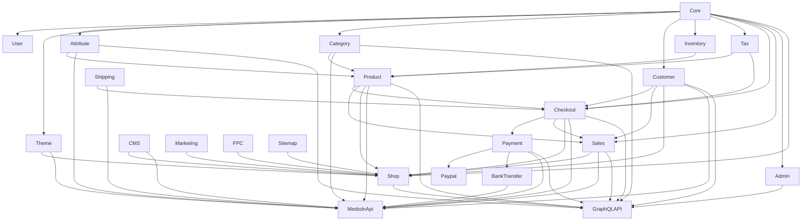

# MedSDN Package Dependency Map

## Overview

هذه الوثيقة تلخص الحزم تحت `packages/medsdn` من زاوية:

- الدور الأساسي لكل package
- التبعيات الأساسية بين الحزم
- الطبقات التي تشكل المنصة
- الحزم الداخلية التي تُحمَّل من monorepo مباشرة ولا تملك `composer.json`

## Layer Model

- Foundation:
  - `Core`, `User`, `Theme`, `DataGrid`, `Installer`
- Application Shells:
  - `Admin`, `Shop`
- Catalog & Pricing:
  - `Attribute`, `Category`, `Product`, `Inventory`, `Tax`, `Rule`, `CatalogRule`, `CartRule`
- Checkout & Order Fulfillment:
  - `Checkout`, `Payment`, `Paypal`, `BankTransfer`, `Shipping`, `Sales`, `BookingProduct`
- Experience & Content:
  - `Customer`, `CMS`, `Marketing`, `Notification`, `DataTransfer`, `GDPR`, `FPC`, `Sitemap`, `SocialLogin`, `SocialShare`, `MagicAI`, `DebugBar`
- API Surfaces:
  - `MedsdnApi`, `GraphQLAPI`

## High-Level Dependency Graph

## Package Index

| Package | Role | Primary Dependencies | Notes |
|---|---|---|---|
| `Admin` | Admin shell, ACL, menus, settings UI | `Core`, `DataGrid`, business packages | routes/config heavy |
| `Attribute` | attributes/families/options | `Core`, `Product` | catalog foundation |
| `BankTransfer` | bank transfer payment flow | `Payment`, `Checkout`, `Sales`, `Customer` | admin/shop/api routes |
| `BookingProduct` | booking product models & flows | `Product`, `Checkout`, `Sales` | specialized product type |
| `CMS` | pages/content | `Core` | storefront content source |
| `CartRule` | cart discounts/coupons | `Rule`, `Checkout`, `Customer`, `Tax`, `Sales` | checkout totals input |
| `CatalogRule` | catalog pricing rules | `Rule`, `Product`, `Category`, `Attribute`, `Customer`, `Tax` | requires price indexing |
| `Category` | category tree & translations | `Core`, `Attribute`, `Product` | storefront navigation |
| `Checkout` | cart/checkout lifecycle | `Product`, `Customer`, `Shipping`, `Tax` | bridge to `Sales` |
| `Core` | infra base, helpers, configs, channels, visitors | foundational | central runtime spine |
| `Customer` | customers, addresses, wishlist, compare | `Core`, `Product`, `Sales`, `Shop` | customer account domain |
| `DataGrid` | admin grid framework | `Core` | UI infra |
| `DataTransfer` | import/export layer | `Attribute`, `Category`, `Customer`, `Inventory`, `Product`, `Tax` | admin tooling |
| `DebugBar` | debug tooling | none | development only |
| `FPC` | full-page cache | `Shop`, `Theme`, `CMS`, `Category`, `Product`, `Marketing` | storefront cache invalidation |
| `GDPR` | GDPR data requests | `Core`, `Customer` | compliance feature |
| `GraphQLAPI` | Lighthouse-based GraphQL stack | almost all business packages + `Admin`/`Shop` | parallel API stack |
| `Installer` | fresh install/bootstrap orchestration | `Product`, `User`, API packages | package bootstrap registry |
| `Inventory` | inventory sources | `Core` | used by product and checkout |
| `MagicAI` | AI integrations | minimal direct deps | extension layer |
| `Marketing` | campaigns, SEO, subscribers | `CMS`, `Category`, `Customer`, `Product`, `Sitemap` | storefront growth features |
| `MedsdnApi` | API Platform REST + GraphQL | `Attribute`, `Category`, `Checkout`, `Customer`, `Sales`, `Product`, `Payment`, `Shipping`, `Theme`, `CMS`, `BankTransfer` | main API surface |
| `Notification` | notifications domain | `Core`, `Sales` | sales/admin related |
| `Payment` | payment abstraction | `Checkout`, `Sales` | extended by `Paypal`, `BankTransfer` |
| `Paypal` | Paypal gateway | `Payment`, `Checkout`, `Sales` | payment extension |
| `Product` | products, images, reviews, variants, price/index data | `Attribute`, `Category`, `Inventory`, `Tax`, `Customer`, `Marketing` | central commerce package |
| `Rule` | common rule abstraction | `Core` | base for `CartRule`, `CatalogRule` |
| `Sales` | orders, invoices, shipments, refunds | `Checkout`, `Customer`, `Inventory`, `Product` | order lifecycle source |
| `Shipping` | carriers and shipping abstraction | `Checkout`, `Core` | checkout shipping logic |
| `Shop` | storefront shell and customer-facing routes | `Theme`, `Customer`, `Product`, `Checkout`, `Sales`, `CMS`, `Marketing` | classic web storefront |
| `Sitemap` | sitemap generation | `CMS`, `Category`, `Marketing`, `Product` | SEO support |
| `SocialLogin` | social auth for customers | `Core`, `Customer` | account/auth extension |
| `SocialShare` | sharing helpers | `Shop`-adjacent | presentation feature |
| `Tax` | tax rates/categories logic | `Core` | consumed by product and checkout |
| `Theme` | theming, assets, view events | `Core`, `Admin` | storefront/admin rendering support |
| `User` | admin users/roles/permissions | `Core`, `Admin` | admin auth and ACL |

## Internal Modules Without composer.json

هذه الحزم تُستخدم فعليًا في runtime، لكنها ليست Composer packages مستقلة:

- `BookingProduct`
- `DataGrid`
- `DataTransfer`
- `DebugBar`
- `FPC`
- `GDPR`
- `MagicAI`
- `Marketing`
- `Notification`
- `Sitemap`

## Dependency Hotspots

- أعلى packages من حيث المركزية:
  - `Core`
  - `Product`
  - `Checkout`
  - `Customer`
  - `Sales`
- أعلى packages من حيث تجميع الاستهلاك:
  - `Admin`
  - `Shop`
  - `MedsdnApi`
  - `GraphQLAPI`

## Bootstrap-Sensitive Packages

- الحزم التي تحتاج first-run setup beyond migrations:
  - `GraphQLAPI`
  - `MedsdnApi`
  - `Product`
  - `CatalogRule`
- المرجع الرسمي لذلك:
  - `packages/medsdn/Installer/src/Support/PackageBootstrap/PackageBootstrapRegistry.php`
